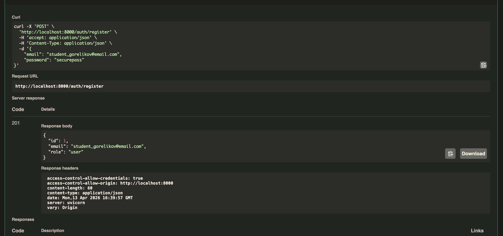
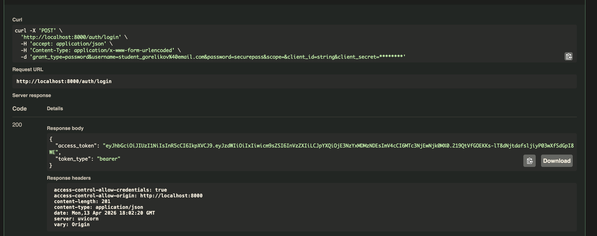
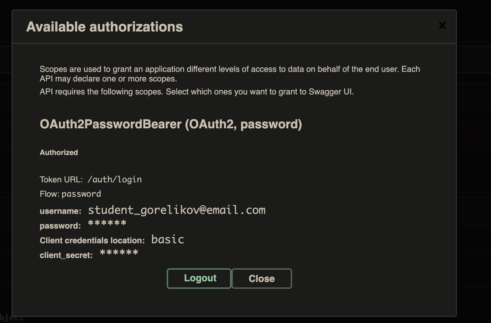
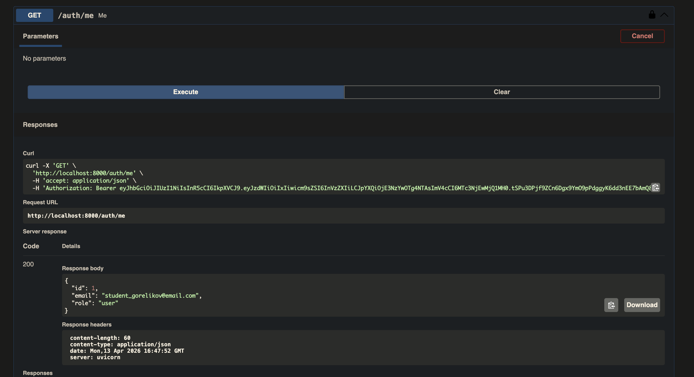
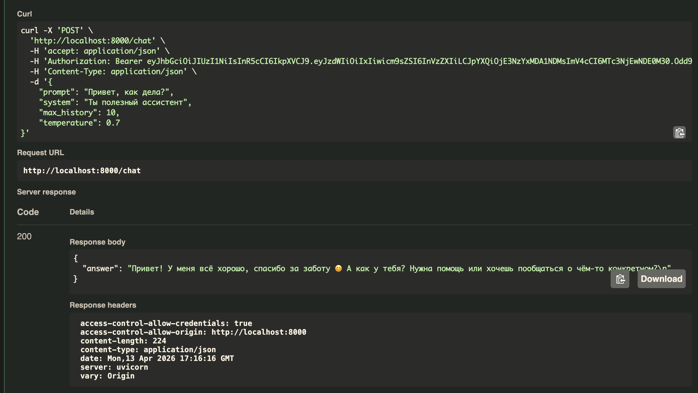
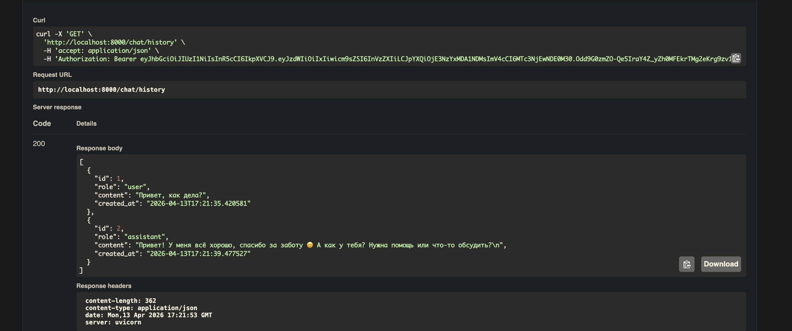
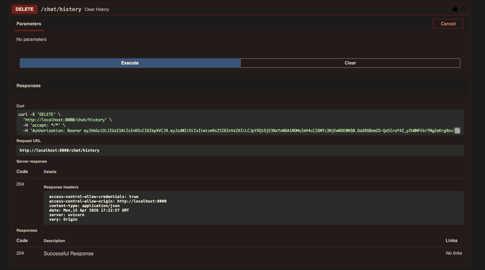

# llm-p — Защищённый API для работы с LLM

Серверное приложение на **FastAPI**, предоставляющее защищённый API для взаимодействия с большой языковой моделью (LLM) через сервис **OpenRouter**.

## Возможности

- Регистрация и аутентификация пользователей (JWT)
- Отправка запросов к LLM (модель `nvidia/nemotron-nano-9b-v2:free`) через OpenRouter
- Хранение истории диалогов в SQLite с привязкой к пользователю
- Swagger UI с поддержкой авторизации через кнопку Authorize

## Архитектура

Проект построен по принципу разделения ответственности:

```
API (тонкие эндпоинты) → UseCases (бизнес-логика) → Repositories (доступ к данным) → DB
                                                   → Services (внешние API)
```

```
app/
├── main.py                    # Точка входа FastAPI
├── core/                      # Конфигурация, JWT, доменные ошибки
│   ├── config.py
│   ├── security.py
│   └── errors.py
├── db/                        # SQLAlchemy: base, session, ORM-модели
│   ├── base.py
│   ├── session.py
│   └── models.py
├── schemas/                   # Pydantic-схемы (вход/выход API)
│   ├── auth.py
│   ├── user.py
│   └── chat.py
├── repositories/              # Репозитории (только SQL/ORM)
│   ├── users.py
│   └── chat_messages.py
├── services/                  # Внешние сервисы
│   └── openrouter_client.py
├── usecases/                  # Бизнес-логика
│   ├── auth.py
│   └── chat.py
└── api/                       # HTTP-эндпоинты и DI
    ├── deps.py
    ├── routes_auth.py
    └── routes_chat.py
```

## Установка и запуск

### 1. Установка uv

```bash
pip install uv
```

### 2. Инициализация проекта и виртуального окружения

```bash
uv venv
source .venv/bin/activate  # macOS / Linux
# .venv\Scripts\activate.bat  # Windows
```

### 3. Установка зависимостей

```bash
uv pip install -r <(uv pip compile pyproject.toml)
```

### 4. Настройка окружения

Скопируйте файл `.env.example` в `.env` и заполните `OPENROUTER_API_KEY`:

```bash
cp .env.example .env
```

Зарегистрируйтесь на [OpenRouter](https://openrouter.ai/) и вставьте полученный API-ключ в `.env`:

```
OPENROUTER_API_KEY=sk-or-v1-ваш-ключ
```

### 5. Запуск приложения

```bash
uv run uvicorn app.main:app --reload --host 0.0.0.0 --port 8000
```

После запуска Swagger UI доступен по адресу: **http://localhost:8000/docs**

### 6. Проверка линтером

```bash
ruff check
```

## API эндпоинты

| Метод    | URL               | Описание                     | Авторизация |
|----------|-------------------|------------------------------|-------------|
| `POST`   | `/auth/register`  | Регистрация пользователя     | —           |
| `POST`   | `/auth/login`     | Логин и получение JWT        | —           |
| `GET`    | `/auth/me`        | Профиль текущего пользователя| JWT         |
| `POST`   | `/chat`           | Отправка запроса к LLM       | JWT         |
| `GET`    | `/chat/history`   | История диалога              | JWT         |
| `DELETE` | `/chat/history`   | Очистка истории              | JWT         |
| `GET`    | `/health`         | Проверка состояния сервера   | —           |

## Использование

### Регистрация

```
POST /auth/register
{
  "email": "student_surname@email.com",
  "password": "securepass"
}
```

### Логин

В Swagger UI нажмите **Authorize**, введите email в поле `username` и пароль — токен будет автоматически подставлен во все защищённые запросы.

### Запрос к LLM

```
POST /chat
{
  "prompt": "Привет, как дела?",
  "system": "Ты полезный ассистент",
  "max_history": 10,
  "temperature": 0.7
}
```

### Получение истории

```
GET /chat/history
```

### Очистка истории

```
DELETE /chat/history
```

## Демонстрация работы

### 1. Регистрация пользователя (`POST /auth/register`)



### 2. Логин и получение JWT (`POST /auth/login`)



### 3. Авторизация в Swagger (кнопка Authorize)



### 4. Профиль текущего пользователя (`GET /auth/me`)



### 5. Запрос к LLM (`POST /chat`)



### 6. История диалога (`GET /chat/history`)



### 7. Очистка истории (`DELETE /chat/history`)



## Технологии

- **Python** ≥ 3.11
- **FastAPI** — веб-фреймворк
- **SQLAlchemy** (async) + **aiosqlite** — ORM и база данных
- **Pydantic v2** + **pydantic-settings** — валидация и конфигурация
- **python-jose** — JWT токены
- **passlib** + **bcrypt** — хеширование паролей
- **httpx** — HTTP-клиент для OpenRouter
- **uv** — менеджер пакетов
- **ruff** — линтер
